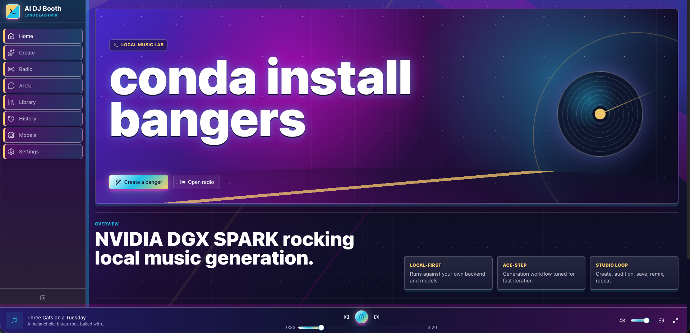

<div align="center">

<h1>conda install bangers</h1>

**Local-first AI music generation studio**


Local AI Music Studio to Generate and remix music entirely on your own machine.
Built on [ACE-Step 1.5](https://github.com/ace-step/ACE-Step-1.5).



</div>

Use it to generate, remix, save, and play AI music on your own machine. The app includes text-to-music, custom generation, remix mode, AI DJ chat, radio stations, a library, and a full audio player.

## Quick Start

### Prerequisites

- Git
- [mise](https://mise.jdx.dev/) installed and activated in your shell

The repo pins Python 3.11, Node.js 20, pnpm 9.15.9, and conda in `.mise.toml`.

### Run Locally

```bash
git clone https://github.com/DEKHTIARJonathan/conda-install-bangers.git
cd conda-install-bangers
mise install
mise run setup
mise run dev
```

The launcher starts:

- backend: `https://localhost:8000`
- frontend: `https://localhost:3000`
- runtime data: `backend/data/`
- model cache: `.cache/models/`

The dev server uses a self-signed HTTPS certificate. Your browser will warn the first time; proceed to the local site. Press `Ctrl+C` to stop both servers.

On first launch, no model is loaded. Open the **Models** page, download/select a DiT model, and optionally select an ACE language model and a chat LLM. Selections are stored in `backend/data/conda-install-bangers.db` and restored on restart.

## Daily Commands

```bash
mise run dev        # Start backend and frontend
mise run test       # Run backend and frontend tests once
mise run clean      # Reset local DB/audio/uploads, keep downloaded models
```

Launcher flags:

```bash
python start.py --install   # Force dependency reinstall
python start.py --no-open   # Do not auto-open the browser
```

After pulling updates:

```bash
git pull
mise run setup
mise run dev
```

## Models

All downloads and active selections happen in the **Models** page. Model selection is intentionally not controlled by environment variables.

Current ACE model registry:

| Type | Models |
|------|--------|
| DiT | `acestep-v15-turbo`, `acestep-v15-base`, `acestep-v15-sft`, `acestep-v15-turbo-continuous`, `acestep-v15-xl-turbo` |
| ACE language model | `acestep-5Hz-lm-1.7B`, `acestep-5Hz-lm-0.6B`, `acestep-5Hz-lm-4B`, or no LM |
| Chat LLM, MLX | `Qwen3-0.6B-4bit`, `Qwen3-1.7B-4bit`, `Qwen3-4B-4bit`, `Qwen3-8B-4bit` |
| Chat LLM, Transformers | `Qwen3-1.7B`, `Qwen3-4B-Instruct-2507`, `Qwen3-8B-FP8`, `Qwen3-14B-FP8`, `Qwen3-30B-A3B-Instruct-2507-FP8` |

Disk usage depends on what you download. The default ACE bundle is about 10 GB, the XL DiT is about 20 GB, and larger chat LLMs add more.

Rough ACE LM guidance:

| VRAM | Suggested LM |
|------|--------------|
| <=6 GB | none |
| 6-8 GB | `acestep-5Hz-lm-0.6B` |
| 8-16 GB | `acestep-5Hz-lm-1.7B` |
| 16-24 GB | `acestep-5Hz-lm-1.7B` or `acestep-5Hz-lm-4B` |
| >=24 GB | `acestep-5Hz-lm-4B` |

## Configuration

Common environment variables:

| Variable | Default | Purpose |
|----------|---------|---------|
| `BANGERS_HOST` | `0.0.0.0` | Backend bind address |
| `BANGERS_PORT` | `8000` | Backend port |
| `BANGERS_DEVICE` | `auto` | `auto`, `cuda`, `mps`, or `cpu` |
| `BANGERS_LM_BACKEND` | `mlx` on macOS, `nano-vllm` elsewhere | ACE LM backend |
| `BANGERS_AUDIO_FORMAT` | `flac` | Default output format |
| `BANGERS_BATCH_SIZE` | `2` | Default samples per generation |
| `BANGERS_INFERENCE_STEPS` | `8` | Default DiT steps |
| `BANGERS_GUIDANCE_SCALE` | `7.0` | Default guidance scale |
| `BANGERS_THINKING` | `true` | Default 5 Hz LM thinking mode |
| `BANGERS_DATA_DIR` | `backend/data` | SQLite DB, audio, uploads |
| `BANGERS_MODEL_CACHE_DIR` | `.cache/models` | Model/cache root |
| `ACESTEP_PROJECT_ROOT` | `.cache/models` | ACE checkpoints and chat LLM root |

Most generation defaults can also be changed in the app under **Settings**.

## Production

The current Docker Compose stack targets a single NVIDIA Linux host and serves HTTP:

```bash
cp .env.example .env
docker compose build
docker compose up -d
```

Open `http://localhost:3000`.

Compose uses two named volumes:

- `bangers-data`: SQLite DB, generated audio, uploads
- `bangers-models`: model weights and Hugging Face cache

See [DEPLOY.md](DEPLOY.md) for GPU prerequisites, upgrades, backups, and failure checks.

## Development

See [DEVELOPMENT.md](DEVELOPMENT.md) for local setup, TLS behavior, cache paths, and test commands.

Run tests:

```bash
mise run test
```

Or run each side directly:

```bash
(cd backend && conda run --prefix .conda pytest -v)
pnpm --dir frontend exec vitest --run
```

## Credits and License

Built on [ACE-Step 1.5](https://github.com/ace-step/ACE-Step-1.5). See [ATTRIBUTION.md](ATTRIBUTION.md) for community inspirations.

Licensed under the [MIT License](LICENSE).
